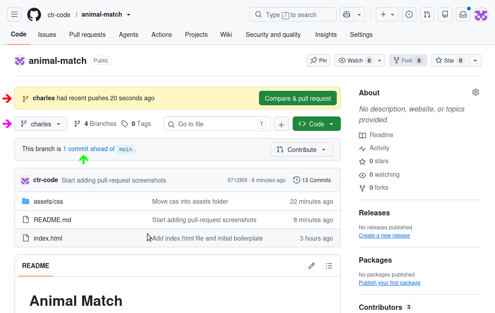
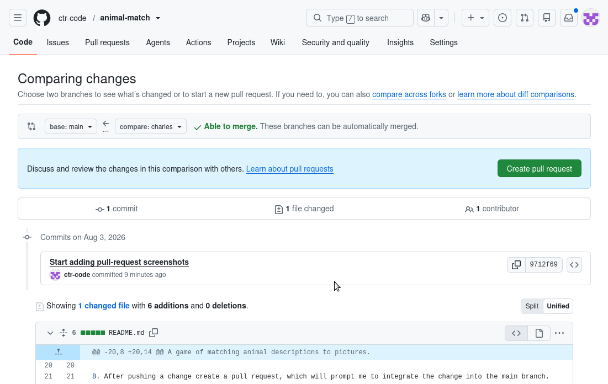
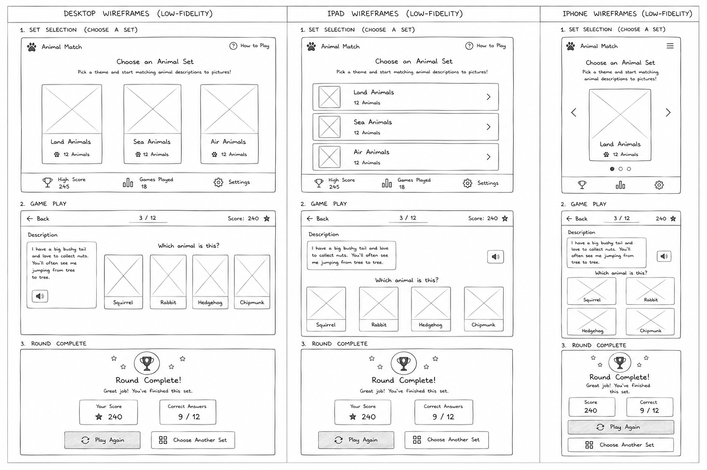

# Animal Match

A game of matching animal descriptions to pictures.

## Project Setup

1. In github accept your invitation to collaborate.  There should be a banner inviting you to.

2. Open the terminal (e.g. in vscode).  If you are in a project folder enter `cd ..` to move up to the folder containing all your projects.

3. Enter `git clone https://github.com/ctr-code/animal-match/` to get a local copy of the project.

4. In vscode select `File | Close Folder` then `File | Open Folder` and choose the animal-match folder.

5. Go back to the terminal.  You should be in the animal-match folder.

6. Create a new branch for your work and switch to it using `git switch -c your-name-here`.  Don't forget to use your name!

7. After you have made some changes and committed them use `git push -u origin your-name-here` to push them to your branch on github.  After you've done this once you can simply use `git push` for future updates.

8. After pushing a change, go to github to create a pull request.  If you see a pull request banner (red arrow) click on the "Compare & pull request" button.  Otherwise, select your branch in the drop down (purple arrow), and click on the "commits ahead" text (green arrow).  You should see something like the second screenshot.  Click on the "Create pull request" button.

Steps 1 & 2 | Step 3
:--: | :--:
 | 

9. Use `git pull origin main` to retrieve other people's changes and merge them into your code.

## User Stories

- As a player, I want to choose from several animal sets such as Land, Sea and Air animals, so that I can play with different themes.
  - Acceptance Criteria:
    - [ ] The game offers multiple animal sets for selection.
    - [ ] Each set has a clear name and theme.
    - [ ] Selecting a set loads the matching questions and images.
  - Tasks:
    - [ ] Display a card for each of Land, Sea and Air animals.
    - [ ] When a card is selected switch to the game page with the url fragment specifying the selection, e.g. `./game.html#air`.

- As a player, I want to choose a difficulty level so I can continue to challenge myself.
  - Acceptance Criteria:
    - [ ] The game provides at least one selectable difficulty option.
    - [ ] The difficulty can be changed before a round starts.
    - [ ] The game matches the selected difficulty level.
  - Tasks:
    - [ ] Create question for additional difficulty levels.
    - [ ] Add difficulty selection to the setup screen.
    - [ ] Display questions from the selected difficulty level during the game.

- As a player, I want to view a description of an animal and a set of pictures of possible answers, so that I can identify the correct animal.
  - Acceptance Criteria:
    - [ ] Each round shows a descriptive clue for the target animal.
    - [ ] The round displays several image choices.
    - [ ] The clue and image choices are clearly presented together.
  - Tasks:
    - [ ] Create the round question layout.
    - [ ] Display the description text and answer images in the UI.
    - [ ] Ensure the layout works for both desktop and mobile screens.

- As a player, I want to select one animal from the picture choices, so that I can make my guess.
  - Acceptance Criteria:
    - [ ] The player can select exactly one answer image.
    - [ ] The selected answer is highlighted clearly.
    - [ ] The choice is saved for evaluation when the player submits it.
  - Tasks:
    - [ ] Add click or tap interaction for each answer choice.
    - [ ] Highlight the currently selected option.
    - [ ] Track the selected answer in game state.

- As a player, I want to move to the next description after I answer, so that the game continues smoothly.
  - Acceptance Criteria:
    - [ ] The game advances to the next question after an answer is submitted.
    - [ ] The transition happens without a page refresh.
    - [ ] The player can continue playing until the round set is complete.
  - Tasks:
    - [ ] Implement the round progression logic.
    - [ ] Clear the previous selection before the next round.
    - [ ] Update the UI to show the next question.

- As a player, I want to receive immediate feedback on whether my choice was correct or incorrect, so that I can learn as I play.
  - Acceptance Criteria:
    - [ ] The player receives feedback right after submitting an answer.
    - [ ] The feedback clearly states whether the answer was correct or incorrect.
    - [ ] The feedback is visible before the next round begins.
  - Tasks:
    - [ ] Compare the selected answer with the correct answer.
    - [ ] Display a clear success or error message.
    - [ ] Add a short delay or transition before moving to the next round.

- As a player, I want to see my score increase or decrease during the game, so that I can track my progress.
  - Acceptance Criteria:
    - [ ] The score updates after each answer.
    - [ ] The score change reflects whether the answer was correct or incorrect.
    - [ ] The current score is visible during gameplay.
  - Tasks:
    - [ ] Define the scoring rules for correct and incorrect answers.
    - [ ] Update the score in the game state as soon as the answer is confirmed as correct or not.
    - [ ] Render the current score in the interface.

- As a player, I want to replay a set or choose another one, so that I can play again without hassle.
  - Acceptance Criteria:
    - [ ] After a game the player can easily replay the current set.
    - [ ] After a game the player can easily choose a new set.
  - Tasks:
    - [ ] Add buttons to the game over screen to retry the current set and to return to the home page.
    - [ ] Reset the game state when a new game starts.
    - [ ] Return the player to the appropriate screen after restart.

- As a player, I want the game to be easy to understand and navigate, so that I can start playing quickly.
  - Acceptance Criteria:
    - [ ] The interface uses clear labels and obvious actions.
    - [ ] A new player can start a game without instructions from another person.
    - [ ] The main actions are easy to find and understand.
  - Tasks:
    - [ ] Review the game flow for clarity and simplicity.
    - [ ] Add any missing instructions or labels.
    - [ ] Test the interface with a first-time user perspective.

- As a player, I want clear and visually appealing animal images, so that the game is enjoyable and easy to read.
  - Acceptance Criteria:
    - [ ] The animal images are clear and easy to recognize.
    - [ ] Images are displayed at a consistent size and layout.
    - [ ] The visual presentation supports gameplay rather than distracting from it.
  - Tasks:
    - [ ] Select or prepare high-quality animal images.
    - [ ] Ensure images load correctly and display consistently.
    - [ ] Adjust styling for spacing, borders, and responsiveness.

- As a parent or teacher, I want themed animal sets, so that the game can be used for learning as well as fun.
  - Acceptance Criteria:
    - [ ] The game includes clearly themed animal sets.
    - [ ] The themes are suitable for educational use.
    - [ ] The content supports learning through recognition and comparison.
  - Tasks:
    - [ ] Choose or create themed animal content.
    - [ ] Organize the content by educational theme.
    - [ ] Add labels or descriptions that support learning.

- As a player, I want the game to work well on a desktop and mobile screen, so that I can play in different environments.
  - Acceptance Criteria:
    - [ ] The game layout adapts to desktop and mobile screen sizes.
    - [ ] Buttons and images remain usable on small screens.
    - [ ] The game remains readable and navigable on touch devices.
  - Tasks:
    - [ ] Review the layout for responsive behavior.
    - [ ] Adjust spacing and sizing for smaller screens.
    - [ ] Test the interface on a mobile-sized viewport.

- As a player, I want to see a simple start screen and game over or completion screen, so that I know when the experience begins and ends.
  - Acceptance Criteria:
    - [ ] The game has a clear start screen before play begins.
    - [ ] The game shows a completion or game over screen at the end.
    - [ ] The end screen explains the result and offers the next action.
  - Tasks:
    - [ ] Design the start screen and end screen layouts.
    - [ ] Add transitions between the start, gameplay, and end states.
    - [ ] Provide a restart or play again action on the end screen.

## Wireframe

The initial UI wireframe is shown below and is the primary design reference during development.

