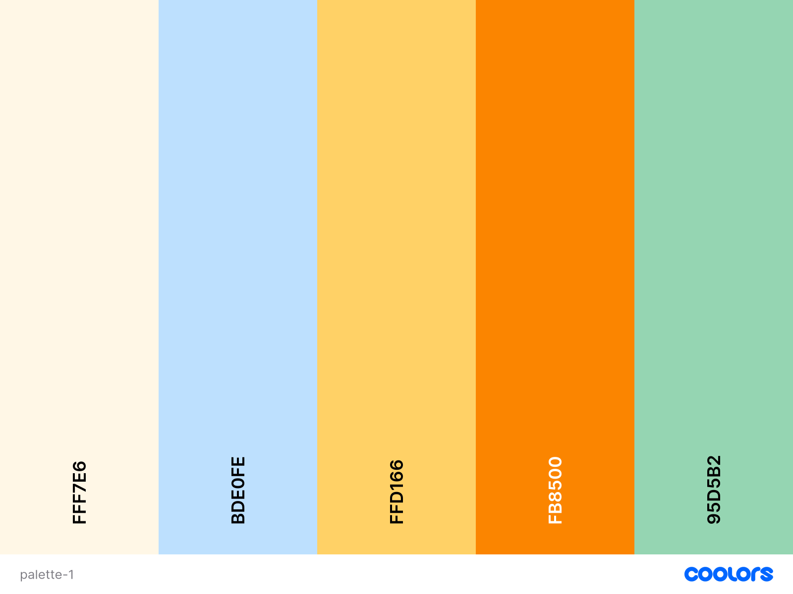
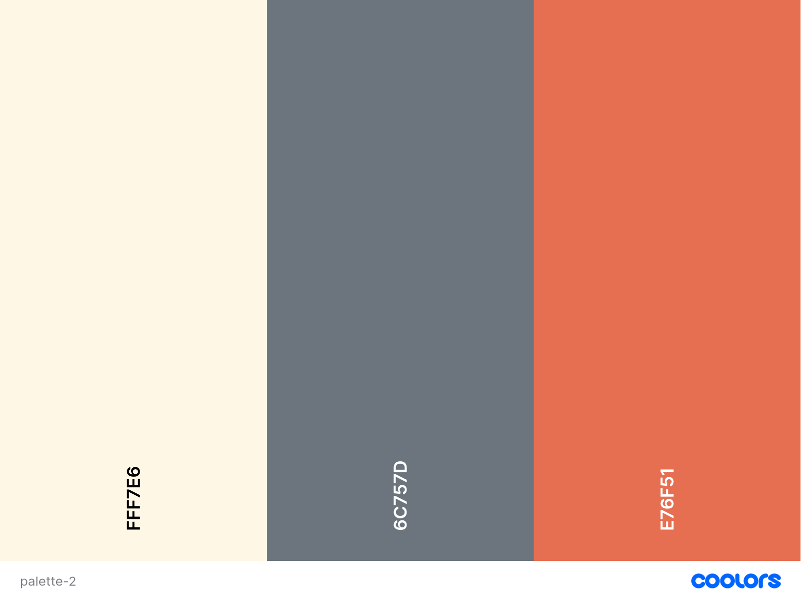
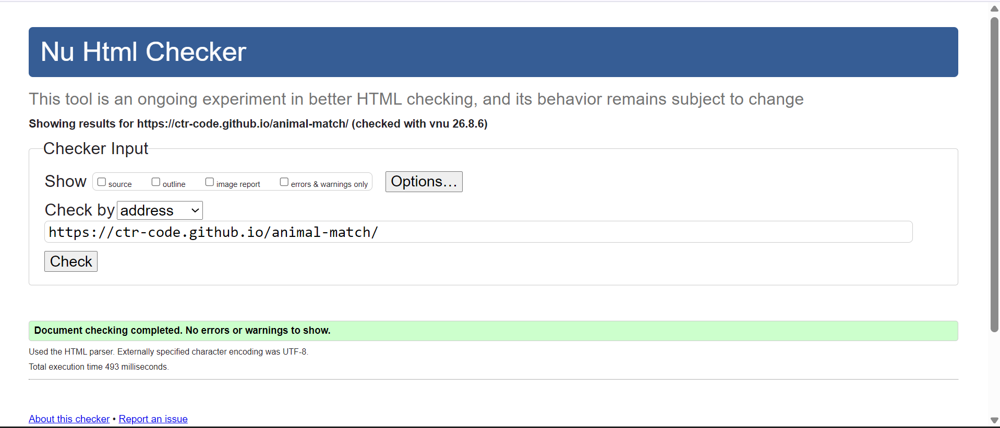
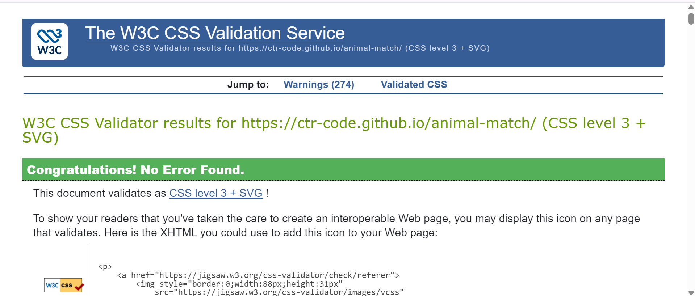
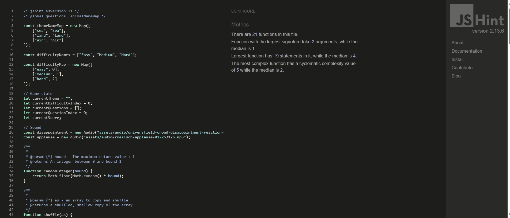
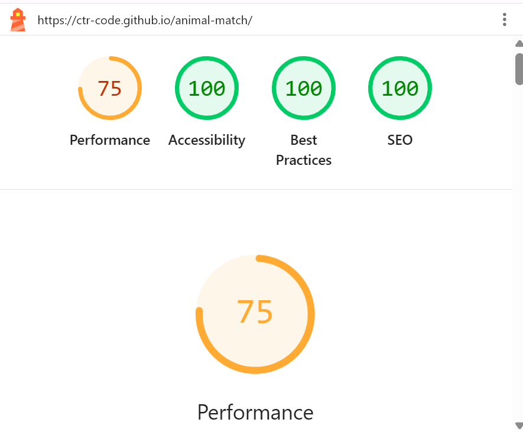
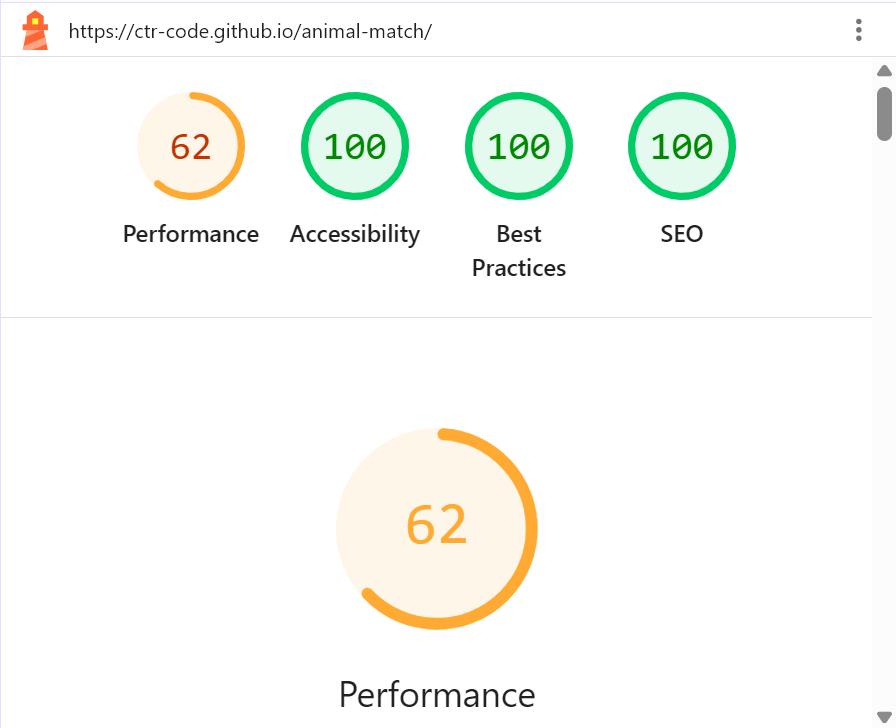
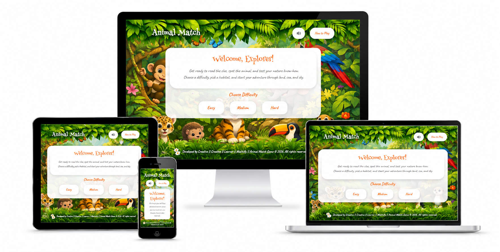

# Animal Match

🚀 **Live Site:** [Animal Match Live Site](https://ctr-code.github.io/animal-match/)

A game of matching animal descriptions to pictures.

---

## Project Setup

1. In github accept your invitation to collaborate.  There should be a banner inviting you to.

2. Open the terminal (e.g. in vscode).  If you are in a project folder enter `cd ..` to move up to the folder containing all your projects.

3. Enter `git clone https://github.com/ctr-code/animal-match/` to get a local copy of the project.

4. In vscode select `File | Close Folder` then `File | Open Folder` and choose the animal-match folder.

5. Go back to the terminal.  You should be in the animal-match folder.

6. Create a new branch for your work and switch to it using `git switch -c your-name-here`.  Don't forget to use your name!

7. After you have made some changes and committed them use `git push -u origin your-name-here` to push them to your branch on github.  After you've done this once you can simply use `git push` for future updates.

8. After pushing a change, go to github to create a pull request.  If you see a pull request banner (red arrow) click on the "Compare & pull request" button.  Otherwise, select your branch in the drop down (purple arrow), and click on the "commits ahead" text (green arrow).  You should see something like the second screenshot.  Click on the "Create pull request" button.

Steps 1 & 2 | Step 3
:--: | :--:
 | 

9. Use `git pull origin main` to retrieve other people's changes and merge them into your code.

---

## Design Brief

### External User’s Goal
The user wants an intuitive, educational, and engaging game to test their knowledge of animals by matching descriptions to pictures.

### Site Owner’s Goal
The site owner’s goal is to build an interactive single-page game that allows users to select themed animal sets, guess animals based on brief descriptions, and track their score across mobile and desktop devices.

---

## Design & Planning

### User Stories

- As a player, I want to choose from several animal sets such as Land, Sea and Air animals, so that I can play with different themes.
  - Acceptance Criteria:
    - Display a card for each of Land, Sea and Air animals.
    - When a card is selected switch to the game page with the URL fragment specifying the selection, e.g. `./game.html#air`.
- As a player, I want to choose a difficulty level so I can continue to challenge myself.
  - Acceptance Criteria:
    - The game provides at least one selectable difficulty option.
- As a player, I want to view a description of an animal and a set of pictures of possible answers, so that I can identify the correct animal.
- As a player, I want to select one animal from the picture choices, so that I can make my guess.
- As a player, I want to move to the next description after I answer, so that the game continues smoothly.
- As a player, I want to receive immediate feedback on whether my choice was correct or incorrect, so that I can learn as I play.
- As a player, I want to see my score increase or decrease during the game, so that I can track my progress.
- As a player, I want to complete a full round of questions in a set, so that I feel a sense of accomplishment.
- As a player, I want to restart a set or the whole game, so that I can play again without hassle.
- As a player, I want the game to be easy to understand and navigate, so that I can start playing quickly.
- As a player, I want clear and visually appealing animal images, so that the game is enjoyable and easy to read.
- As a parent or teacher, I want themed animal sets, so that the game can be used for learning as well as fun.
- As a player, I want the game to work well on a desktop and mobile screen, so that I can play in different environments.
- As a player, I want to see a simple start screen and game over or completion screen, so that I know when the experience begins and ends.

### Wireframe

The initial UI wireframe is shown below and is the primary design reference during development.

### Typography
* **Headers & Body Text:** Standard Bootstrap sans-serif font stack.

### Colour Scheme

Below are the colour palettes provided by Kieron for the Animal Match project:

---

## Features

### Planned Features
* **Theme Selection:** Select from themed animal categories (e.g., Air, Sea, Land).
* **Interactive Guessing Game:** Read animal descriptions and click matching images.
* **Instant Feedback & Score Keeping:** View real-time score updates and immediate correct/incorrect feedback.
* **Completion Screen:** Option to replay or restart sets upon completion.

---

## Copilot & Gemini AI Assistance

### Image Optimization Script (GIMP & Copilot)
* **Usage:** Copilot was used to write a GIMP script to convert `.png` images to `.webp`.
* **Challenges:** 
  * The first version failed due to a hallucinated function.
  * The second version produced images of very low quality.
  * The third version failed to set quality correctly because it called a function with the wrong number of parameters.
  * Copilot failed over many attempts to point to the correct function documentation.
* **Outcome:** The documentation was located manually to fix the script. This highlighted that AI tools can struggle with obscure technologies and APIs.

### Bug Fixing & Code Implementation
* **JS Validator & Console Error Fix:** AI was used to solve a console error appearing in the JavaScript validator regarding placeholder images in game cards. An initial suggestion to replace the source with an SVG failed, but a second suggestion to use `favicon.ico` succeeded as it was already loaded by the browser.
* **CSS-Only Modals:** AI was used to explain and implement modal functionality without requiring extra JavaScript.
* **Code Snippets:** AI assistance was used to check code, write standard snippets, and provide favicon file/link references.
* **Gemini AI Reflections:** Gemini AI was used to assist with documentation editing, structuring manual test suites directly from the HTML code, and organizing file structure guidelines for GitHub PRs.

---

## Technologies Used

* **HTML5**
* **CSS3**
* **JavaScript**
* **Bootstrap:** Used for containers and layout structure throughout the project to keep the file structure organized and easily targeted for styling/scripting.
* **VSCode:** The primary IDE used to write and develop code for the project.
* **GitHub:** Used for repository hosting, project management, branch workflow, and deployment.
* **Am I Responsive? (Fireship):** Used for creating screenshots of the app's responsiveness across desktop and mobile devices.
* **W3C Markup Validation Service:** Used to test and validate HTML code.
* **Google DevTools:** Used for debugging functionality, checking console errors, and running Lighthouse audits.

---

## Testing & Validation

### Code Validation

### Performance & Responsiveness

### Manual Testing

| Element / Feature | Test Action | Expected Result | Result |
| :--- | :--- | :--- | :---: |
| **Navbar Brand Link** | Click `.navbar-brand` (`Animal Match`) | Reloads or navigates to `index.html` | Pass |
| **How to Play Button** | Click `#how-to-play` button in header | Opens `#instructions-modal` dialog | Pass |
| **Close Instructions Button** | Click `#close-instructions-btn` in modal | Closes the instructions dialog | Pass |
| **Difficulty Selection** | Click `.difficulty-btn` (Easy/Medium/Hard) | Sets game difficulty level | Pass |
| **Theme Selection** | Click `.theme-card` (Land, Sea, or Air) | Selects animal category set | Pass |
| **Status Bar Display** | View `#theme-value`, `#difficulty-value`, `#question-count`, and `#score-value` | Displays active values (`Land`, `Easy`, `1 / 8`, `0`) | Pass |
| **Progress Bar** | Check `#progress-bar` width styling | Renders initial percentage (`12.5%`) visually | Pass |
| **Description Box** | Read `#clue-text` paragraph | Displays animal description text accurately | Pass |
| **Answer Option Cards** | Click an answer button (`.answer-option-btn`) e.g. `#answer-option-1` | Selects answer, triggers feedback overlay (`#wrong-answer-overlay` on incorrect) | Pass |
| **Start Over Button** | Click `#restart-btn` | Resets active question state | Pass |
| **Next Question Button** | Click `#next-btn` after selecting answer | Advances question count and updates clue/choices | Pass |
| **Round Complete Panel** | Reach final question in set | Displays `#round-complete-section` panel | Pass |
| **Final Score & Correct Count** | Check summary values on completion screen | Displays `#final-score` and `#final-correct` ratio (`6 / 8`) | Pass |
| **Play Again Button** | Click `#play-again-btn` | Resets game state and restarts current set | Pass |
| **Choose Another Set Button**| Click `#choose-set-btn` | Returns to set selection section | Pass |

---

## Bugs
* **JS Validator Console Error:** Resolved console errors regarding placeholder images by utilizing `favicon.ico` already available in the browser environment.
* **Fireship Screenshot Styling:** Changed Fireship tool background to white using browser DevTools to ensure responsive screens remain clearly visible in dark/light modes.
* **Footer Blocking Button Click/Cursor:** Fixed an issue where the footer overlay blocked cursor interaction and button clicks by applying `pointer-events: none` to the footer overlay element.

---

## Deployment

### Live Site
The live deployed site can be accessed here: [Animal Match Live Site](https://ctr-code.github.io/animal-match/)

### Forking & Cloning
1. Navigate to the GitHub repository.
2. Click **Fork** to create a copy under your account.
3. Clone locally using `git clone <your-fork-url>`.

### GitHub Pages Deployment
1. Go to repository **Settings**.
2. Select **Pages** from the left navigation.
3. Set the deployment branch to `main` (or `master`) and click **Save**.

---

## Credit and Thanks

* **[Code Institute](https://codeinstitute.net/)** and its tutors for teaching, support, and project guidance.
* **[West Midlands Combined Authority](https://www.wmca.org.uk/)** for funding the course.
* **[Tim Berners-Lee](https://w3.org/) et al.** for creating the web.
* **[GitHub](https://github.com/)** for repository hosting and GitHub Pages.
* **[Bootstrap](https://getbootstrap.com/)** for layout styling and component styling.
* **[Coolors](https://coolors.co/)** for color palette generation.